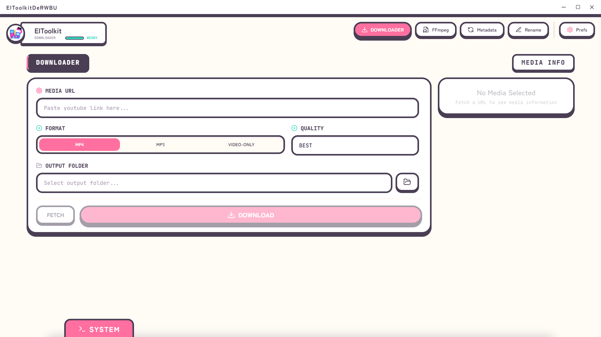

# ElToolkitDeRWBU

A multipurpose desktop utility built with Tauri v2, React, TypeScript, and Vite. ElToolkitDeRWBU wraps powerful command-line tools like FFmpeg and yt-dlp in a clean graphical interface, letting you handle media processing, file organization, and downloads without touching a terminal.

## Overview

ElToolkitDeRWBU brings several everyday file and media workflows into one cohesive app — download, convert, tag, and rename, all from a single interface built for batch processing.

## What's New in v0.1.1

- **Redesigned UI** — A visual novel/game-inspired aesthetic with thick borders, flat colors, and subtle micro-animations for a more polished, game-like feel.
- **Custom titlebar** — Native OS window decorations replaced with a custom, integrated titlebar (native context menus disabled to keep the design consistent).
- **Background operation** — An optional setting to minimize to the system tray on close, with tailored notifications so tasks keep running without getting in the way.
- **Task cancellation** — Long-running operations (batch tagging, encoding, etc.) can now be safely aborted from any processing menu.

## Core Features

### Media Downloader (yt-dlp)
Download media from supported URLs, preview media info beforehand, and cancel downloads safely mid-process.

### FFmpeg Tools
- **Audio Extraction** — Pull audio tracks out of video files.
- **Trimming** — Cut video or audio to a specific start and end time.
- **Mirroring** — Flip media horizontally or vertically.

### Batch Metadata Editor
Edit ID3 tags (Title, Artist, Album, Year) for single MP3 files or entire folders, with real-time logs and per-file status tracking.

### Batch File Renamer
- **Find & Replace** — Case-sensitive text replacement in filenames.
- **Affixes** — Add prefixes or suffixes.
- **Numbering** — Sequential, zero-padded numbering (e.g., `Track_001`).
- **Preview & Undo** — Collision detection before applying changes, plus full undo for the last operation.